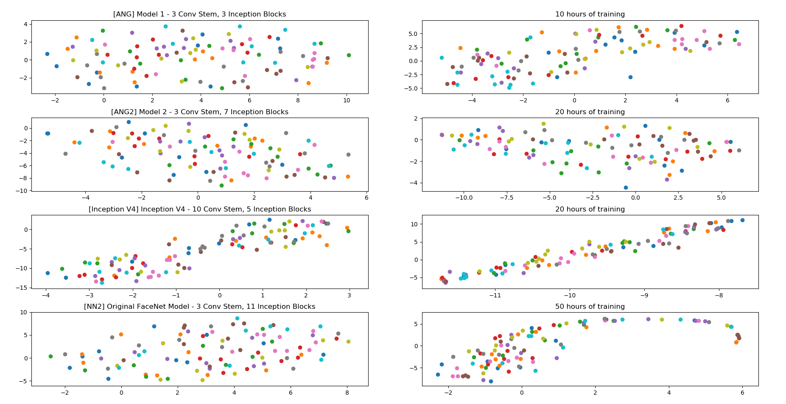
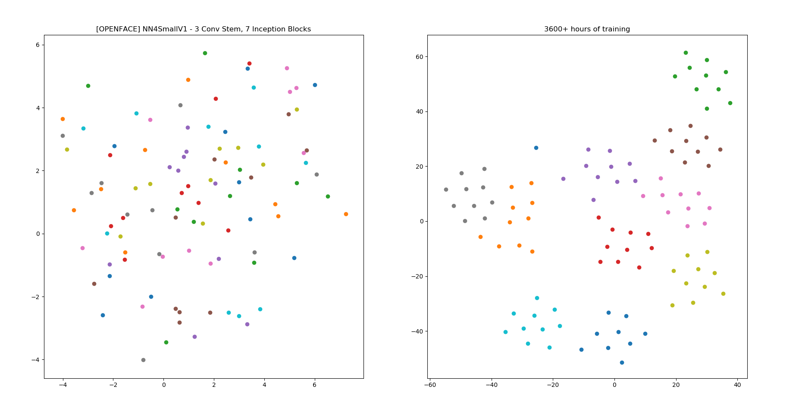

# Facial Recognition

This is an experimental project aimed at training different deep neural network architectures from scratch for facial recognition. A combination of [FaceScrub](http://vintage.winklerbros.net/facescrub.html), [LFW](http://vis-www.cs.umass.edu/lfw/), [MS Celeb](https://www.microsoft.com/en-us/research/project/ms-celeb-1m-challenge-recognizing-one-million-celebrities-real-world/) (downloadable from [here](https://academictorrents.com/details/9e67eb7cc23c9417f39778a8e06cca5e26196a97/tech&hit=1&filelist=1)) were used to train 4 different architectures. Training was carried out on a single consumer grade NVidia GeForce GTX 1060 6GB. The results of training from scratch in this constrained setup is compared to a [pretrained openface model (NN4small2V1)](https://cmusatyalab.github.io/openface/models-and-accuracies/#model-definitions).

## Prerequisites

Last run on these versions, newer versions not tested

- tensorflow (v1.12.0)
- keras (v2.2.4)
- opencv (v4.2.0)
- numpy (v1.15.4)
- sklearn (v0.20.2)
- dlib (v19.20.0)
- matplotlib (v3.0.2)

Download the weights from [here](https://drive.google.com/drive/folders/111IArOLKqG2ELdGO-tVryDtviDlgg34H?usp=sharing) and put it in the `weights` directory to get similar results

## Run

- **`recognize.py`** - Place the face images of people to recognize in the `people` directory and run this script to identify faces from the camera video feed.
- **`visualize.py`** - Generate the benchmark result images shown in this README which compares the models trained from scratch to the pretrained openface model.
- **`train.py`** - Download the dataset of people's face images from any source (Facescrub, LFW, MS Celeb) and train any of the model architectures with this data. This script saves the weights after training

Any other model or a weights file can be used with the `recognize.py` script (with minor code modifications) to reuse parts of code for reading from camera and drawing bounding boxes. The same goes for `visualize.py`

## Results

While it is obvious there is no way that a sub par training environment and resource constraint leads to a well performing model. We observed progress of our models from their randomly initialized states towards the ideal openface model pretrained for many hours on bigger compute clusters.

The final layer of all these architectures are 128-dimensional vectors. Using TSNE, we can visualize these higher dimension vectors and compare how close they are to the expected outputs. In the following figures, the plots on the left show the untrained state of each model while the plots on the right show how similar faces have been moving closer to each other after some amount of training (this is the expected behaviour).

  

The face images used for benchmarking and comparing can be found in the `benchmark_faces` directory. It has 10 faces each of 10 different individuals. Every dot in the plots represent a face image's final layer 128-dimensional encoding in the mentioned model architecture. Dots of the same color represent the same person. Ideally, the distance between dots of the same color must reduce and the distance between dots of different colors must increase through the course of training. This is shown to be the case with openface's NN4small2V1 model.

  

This shows a clear clustering of the faces of the same person. Although the 4 models did not reach this far in their training process, we see subtler indications of the same colored dots moving towards each other and clustering in the previous set of plots.

This project was taken up to understand the challenges which exist in building the complete pipeline of a performant deep learning model.